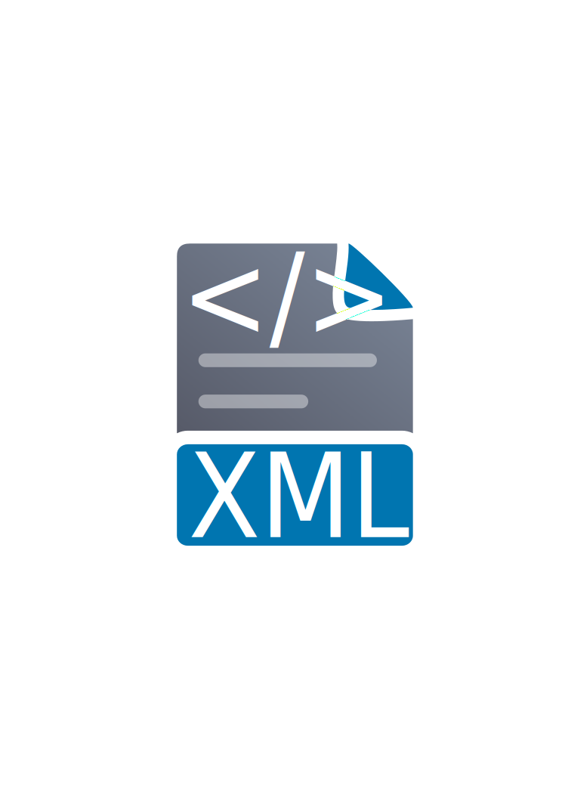

# XmlFormat, aka `xf`

XmlFormat (project name), aka `xf` (command name)
is a simple and straightforward XML formatter
written in C#.

## ⚡ Getting Started

### 🔧 Installation

```bash
dotnet tool install -g XmlFormat
```

This will make `xf` available on the commandline.

### Print an XML file after formatting

```bash
xf <file.xml>
```

or

```bash
cat <file.xml> | xf
```

### Format an XML file and write the result back

```bash
xf --inline <file.xml>
```

### Format many XML files

```bash
xf --inline *.xml
xf --inline `fd xml$`
fd xml$ -x xf {}
```

## 🔨 Build the Project

```bash
dotnet build
```

## ▶ Settings

The configuration file for `xf` is, unironically,
a TOML file in the current directory from which the tool is run,
called `.xmlformat`.

```toml
```

## 🤝 Collaborate with My Project

Please refer to [COLLABORATION.md](COLLABORATION.md).
